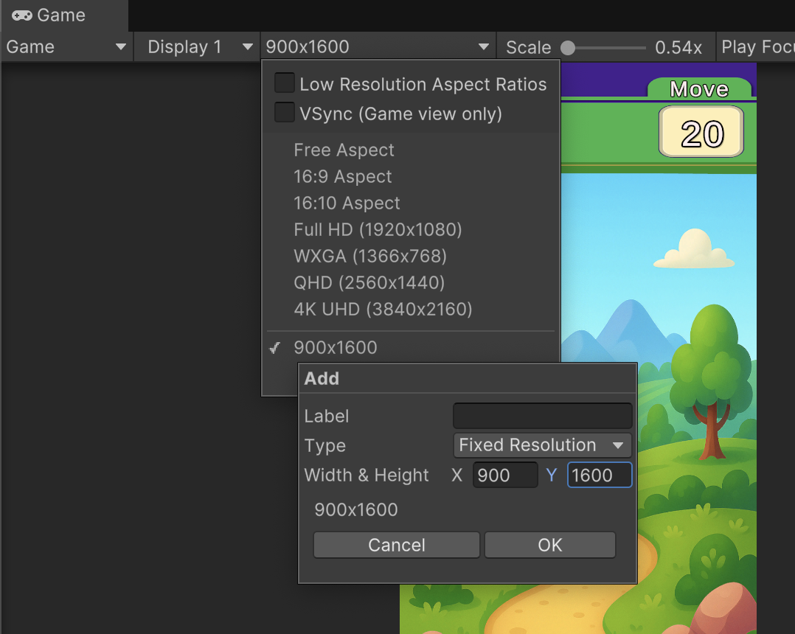

# Match3Type

A **Match-3 style game**, developed as part of the learning process in Unity.  
Since this was a beginning project, it is not well designed and lacks proper OOP practices and optimizations (e.g., inheritance, object pooling). I might update it in the future.

## Gameplay

## Setup
- Please add `900x1600` fixed resolution to the aspect ratio menu before playing.  

- Start the game by loading **MainScene** from the `Scenes` folder.

## How to Play
- Works with the classic swipe mechanics: hold and drag with **left mouse button**.  
- You can place rockets on the clicked Cube by pressing **right + left mouse button** at the same time (debug purposes).  

## Editor Notes
- You can set the last level from the top editor menu → **Tools → Set Last Played Level**.  
- There are no rocket combo or hint system like my Blast game.  
